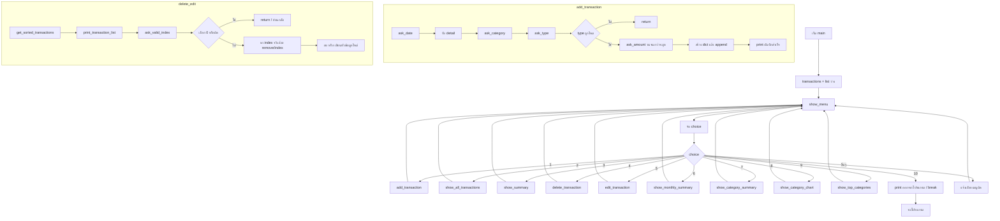

# Pseudocode และ Flowchart: โปรแกรมบันทึกรายรับ-รายจ่าย

## Pseudocode

```
ฟังก์ชัน show_menu(): แสดงเมนู 1-10

ฟังก์ชัน ask_date(): วน loop ถามวันที่ ปปปป-ดด-วว, เช็คเป็นตัวเลขครบ 3 ส่วน,
    เช็คเป็นวันที่จริงตามปฏิทินด้วย datetime.date (จับ ValueError ถ้าวันไม่มีจริง)
    return วันที่แบบเติม 0 นำหน้าแล้ว (ปปปป-ดด-วว)
ฟังก์ชัน ask_type(): ถามประเภท รับ/จ่าย return string หรือ None ถ้าเลือกผิด
ฟังก์ชัน ask_amount(): วน loop ถามจำนวนเงินจนกว่าจะเป็นตัวเลขและ >0 แล้ว return ค่า
ฟังก์ชัน ask_category(): ถามหมวดหมู่ (ข้อความอิสระ) return string
ฟังก์ชัน ask_valid_index(list, ข้อความ): ถามหมายเลข, "0" = ยกเลิก return None,
    เช็คเป็นตัวเลขและอยู่ในขอบเขต list, return index หรือ None

ฟังก์ชัน get_sorted_transactions(transactions):
    return list ใหม่เรียงตามวันที่จริง (แปลงวันที่เป็น [ปี, เดือน, วัน] ตัวเลขก่อนเรียง)

ฟังก์ชัน calculate_summary(transactions): วน loop รวม รายรับ/รายจ่าย คืนค่า (รับ, จ่าย, คงเหลือ)
ฟังก์ชัน calculate_category_summary(transactions):
    วน loop รวมยอด "รายจ่าย" แยกตามหมวดหมู่ด้วย dict
    return list [(หมวดหมู่, ยอดรวม), ...] เรียงจากมากไปน้อย
ฟังก์ชัน print_transaction_list(transactions): วน loop print แต่ละรายการ (ไม่เรียง เรียงมาก่อนแล้ว)

ฟังก์ชัน add_transaction(transactions):
    date = ask_date() ; detail = รับ input ; category = ask_category()
    type = ask_type() ; ถ้า None ออกจากฟังก์ชัน
    amount = ask_amount()
    เพิ่ม dict{date, detail, category, type, amount} เข้า transactions

ฟังก์ชัน show_all_transactions(transactions):
    ถ้า list ว่าง แจ้งเตือน แล้วจบ
    ไม่งั้น print ตาราง (เรียงตามวันที่) + calculate_summary แล้ว print สรุป

ฟังก์ชัน show_summary(transactions): เรียก calculate_summary แล้ว print

ฟังก์ชัน show_monthly_summary(transactions):
    รับเดือน ปปปป-ดด, กรองรายการที่ date ขึ้นต้นด้วยเดือนนั้น (เรียงตามวันที่)
    ถ้าไม่มีรายการ จบ
    แสดงเมนูย่อย 1.รวม 2.เฉพาะรายรับ 3.เฉพาะรายจ่าย 0.ย้อนกลับ
    print รายการ + ยอดรวมตามที่เลือก

ฟังก์ชัน show_category_summary(transactions):
    เรียก calculate_category_summary แล้ว print แต่ละหมวดหมู่ + ยอดรวม

ฟังก์ชัน show_category_chart(transactions):
    เหมือน show_category_summary แต่คำนวณความยาวแท่ง (เทียบสัดส่วนกับหมวดที่มากสุด)
    และ % ของยอดรายจ่ายรวม แล้ว print เป็นแท่งกราฟ

ฟังก์ชัน show_top_categories(transactions, top_n=3):
    เรียก calculate_category_summary แล้ว print แค่ top_n อันดับแรก

ฟังก์ชัน delete_transaction(transactions):
    ถ้า list ว่าง จบ
    sorted_transactions = get_sorted_transactions(transactions)
    print_transaction_list(sorted_transactions), ask_valid_index
    ถ้าไม่ None: transactions.remove(sorted_transactions[index])   # ลบ object เดิมใน list จริง

ฟังก์ชัน edit_transaction(transactions):
    ถ้า list ว่าง จบ
    sorted_transactions = get_sorted_transactions(transactions)
    print_transaction_list(sorted_transactions), ask_valid_index
    ถ้าไม่ None:
        real_index = transactions.index(sorted_transactions[index])
        ถามข้อมูลใหม่ทั้งหมด (date/detail/category/type/amount)
        เขียนทับ transactions[real_index]

ฟังก์ชัน main():
    transactions = list ว่าง
    วน loop ตลอด:
        show_menu()
        รับ choice
        เรียกฟังก์ชันตาม choice (1-9)
        ถ้า choice == 10: print แล้ว break
        ไม่งั้น: แจ้งเลือกผิด

ฟังก์ชัน _selftest():
    เช็ค calculate_summary กับ list ว่างและข้อมูลตัวอย่างด้วย assert
    เช็ค calculate_category_summary กับข้อมูลตัวอย่าง
    เช็คการกรองตามเดือนด้วยข้อมูลตัวอย่าง

เริ่มโปรแกรม: _selftest() แล้ว main()
```

## Flowchart


